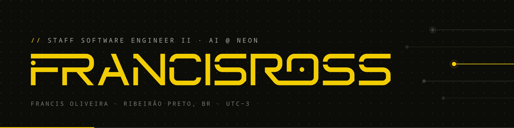
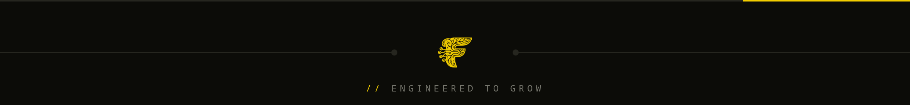

<samp><a href="./README.md">PT-BR</a> · <b>EN</b></samp>

## <samp>// ABOUT</samp>

**Staff Software Engineer II — AI @ Neon.** For 14 years I've been turning technology into results — today building Generative AI at scale at one of Brazil's largest digital banks.

I started in 2010 migrating an ERP from Clipper to Delphi in rural Rondônia. Along the way: led teams, scaled distributed systems, taught classes, and mentored over a hundred developers. I believe technology exists to serve the business — and that no one builds a career alone.

<samp>14+ YEARS IN TECH · 6+ YEARS LEADING TEAMS · 100+ DEVS MENTORED</samp>

## <samp>// CURRENTLY BUILDING</samp>

- **[batuta](https://github.com/franciscpd/batuta)** — orchestration for Claude Code: Claude conducts, cheaper executors play
- **[lyra-ds](https://lyra-ds.dev)** — CSS-first design system: 78 components, 211 semantic tokens, zero runtime JS
- **MCP servers** for Gmail, Calendar, and Drive — AI agents operating real tools
- **Generative AI at scale** at Neon — LLMs, RAG, and agents in production
- **[Mentoring](https://francisross.com.br/en/#mentoria)** on career, tech, and product — first session is on me

## <samp>// TECH STACK</samp>

<samp>GENAI</samp>

    

<samp>BACKEND</samp>

    

<samp>FRONTEND</samp>

    

<samp>LEADERSHIP</samp>

   

## <samp>// CONSISTENCY</samp>

## <samp>// FEATURED PROJECTS</samp>

| | |
|---|---|
| **[batuta](https://github.com/franciscpd/batuta)**  The conductor doesn't play — orchestration for Claude Code with atomic commits and resumable state. Plugin · MIT | **[lyra-ds](https://github.com/lyra-ds/lyra)**  CSS-first design system: 78 components, 211 tokens, zero runtime JS. CSS/React · MIT |
| **[mcp-server-gmail](https://github.com/franciscpd/mcp-server-gmail)**  MCP server for Gmail — email operated by AI agents. TypeScript | **[mcp-server-calendar](https://github.com/franciscpd/mcp-server-calendar)**  MCP server for Google Calendar — events managed by agents. TypeScript |
| **[mcp-server-drive](https://github.com/franciscpd/mcp-server-drive)**  MCP server for Drive, Docs, Sheets, and Slides. TypeScript | **[phoenix-ai](https://github.com/franciscpd/phoenix-ai)**  AI integration library for Elixir, inspired by laravel/ai. Elixir |

## <samp>// LET'S TALK</samp>

Ready to unlock your next phase? The first assessment session is free — no strings attached, with an action plan.

    

